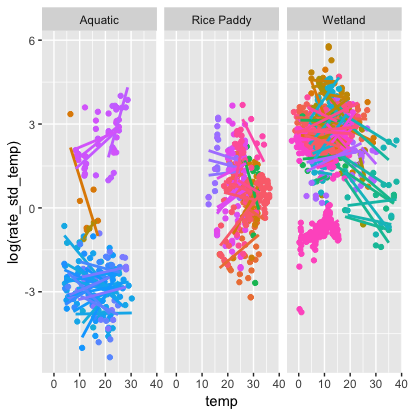

An attempt at calculating ecosystem gas flux rates at a standard temperature.
Likely there are errors in these calculations.

- Currently only available for CH4.
- Planned: CO2
  - Challenge: activation is different for respiration and photosynthesis...
      - Use activation for net photosynthesis for daytime measurements and activation for respiration for dark measurements?

package can be installed with 

```r
require(devtools)
install_github("low-decarie/gasfluxcalc")
```

though this may be overkill considering a single function to date

Calculation based on 

[Methane fluxes show consistent temperature dependence across microbial to ecosystem scales Gabriel Yvon-Durocher, Andrew P. Allen, David Bastviken, Ralf Conrad, Cristian Gudasz, Annick St-Pierre, Nguyen Thanh-Duc & Paul A. del Giorgio](https://www.nature.com/articles/nature13164#online-methods)


Removing the effect of temperature to see difference between ecosystems.


